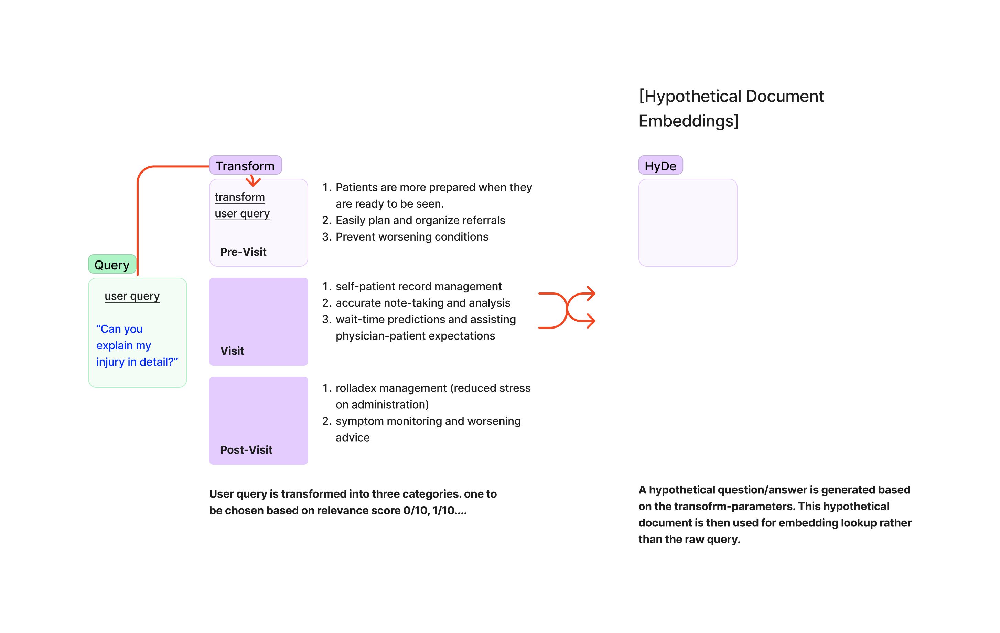

# Medex-Public-MITP

[!(https://github.com/Unstructured-IO/)]
Welcome to the Medex public repo, the Public version's for Open-Source Medex updates, changes, and contributions. Application specific readme notes can be found within the main directory. 

<h1>Hello! Welcome to Medex Playground. A new starting point on our application journey.</h1>

<h3> Latest Update: 7/7/2023 </h3>

To get started, simply clone this repo-and enter your key values in the playground. You should immediately (upon completion of our initial setup here) you should be able to enter your configurations into the playground-codeblocks as needed, and then being q/a over your data. Given this is day #2 of our project, the code is still being updated. Keep in mind, this means we'll begin seeing health/medical specific components beginning to be integrated in the coming weeks. As time progresses, the less effective generic data/documents will be, and the more effective health/medical specific data/documents will be.

Last night, and after evaluation and further consideration I've decided to implement the Llama-Index. The considerations for approval are the following:
a. the Llama-Index uses new technologies to integrate query revisions, such as the Transform Query function, which takes a User-Query and transforms it into a query that is more likely to return the desired results. 
b. Hypothetical Document Embeddings (HyDE) query transform; HyDe is a new method for transforming queries that uses a neural network to generate a query that is more likely to return the desired results. It takes the User query, provides an answer, and then uses those answers to generate similar embeddings. 
c. easily integrates with our existing Langchain and Medex-Index.
d. improved ingestion function such as Transformer-Embedding Accleration, which is a new method for accelerating the embedding generation process. It uses a transformer model to generate embeddings for each chunk of text, which are then used to index the document. This allows the application to quickly find similar documents or chunks based on their embeddings. Query Splitting which enables the model to query specific chunks, in specific documents, and return the results. Or, even Query Transformations where the query is expanded into 5+ relevant queries, all answers are searched within the embeddings, and then the best anwer is formed. 

Generally, I believe the implementation of the Llama-Index will help to substantially accelerate our progress, while being able to provide moderate improvements to our existing models in complex areas of forward/backward document processing. 
<h6>End Update.</h6>

* Last (first) update: 6/7/23; These documents are being continuously updated. Today (6/7/23) was the first day of the project release. While I've been working dilligently in the background, it's always been a goal of mine to cerate a meaningful public repository. I'm excited to share this with you. I hope you enjoy it. 

** I'm having some difficulty with the privacy concerns related to the sample_patient_files that I've been recieving. As of today (7,7,2023) - I'm planning to blackout the privacy details of these documents so that the samples can be used by everyone. However, given the length, 2,000+ pages per document, it may take some time to ensure this is completed efficiently and according to our standards for the privacy of our Users, even in prototyping stages. In the meantime, I will not be pushing the sample-patient-files until they're ready/ likely next week. 

[]: # Path: readme.md
[]: # See knowledge-base snippets from Medex/Course-Work/Helpful_Links and Cool_Repos, followed by relevant coursework (free and paid), model catalogue and downloadable products. Sample patient files will be uploaded soon. 
[]: # The .env requirements and setup instructions for the virtual environment and .env keys, you can check the .env file in the <Medex> directory, and/or the my-venv instructions within the jupyter-playground. I'll piece together a more formiddable instruction set, with new files that are easier to navigate in the near future. 
[]: # 

<h2>Ingest.py</h2>

<h4>The process_files function in the ingest.py script is responsible for processing all the PDF files in a given directory. It does this by creating a UnstructuredAPIFileLoader for each PDF file, which is used to load the document and split it into chunks. These chunks are then embedded using the OpenAIEmbeddings and added to the MyScale index. The embeddings are also saved to a JSON file for each document.

The improvements made to this function are primarily focused on the use of partitioning bricks from the Unstructured library. Partitioning bricks are used to extract structured content from raw unstructured documents, breaking them down into elements such as Title, NarrativeText, and ListItem. This allows the application to decide what content to keep for its specific use case.

Here's how the ingestion work:

Document Loading: The UnstructuredAPIFileLoader is used to load the document. This loader uses the Unstructured library to extract structured content from the raw unstructured document. This is done using partitioning bricks, which break the document down into elements such as Title, NarrativeText, and ListItem.
Document Splitting: The CharacterTextSplitter is used to split the document into chunks. This is necessary because language models like GPT-3 have a maximum token limit, and large documents need to be split into smaller chunks to be processed.
Embedding Generation: The OpenAIEmbeddings is used to generate embeddings for each chunk. These embeddings are vector representations of the text that capture semantic meaning and can be used for tasks like similarity search.
Indexing: The MyScale index is used to store and retrieve the embeddings. This allows the application to quickly find similar documents or chunks based on their embeddings.
Metadata Tracking: The Unstructured library tracks a variety of metadata about the elements extracted from documents. This metadata can be used to filter document elements based on criteria of interest, such as page number or source file.</h4>

July 7, 2023:
Today was the first day of opening the Public repo. I'll continue to update the files as I upload them and reformat the files to create a more unified experience for contributors, or Users who simply want to play with the program in their termainal. 

As of today, we're still using the OpenAI library for most of our interactions with a language model. The Medex application will continue to be developed moving towards its ultimate goal of a unified multi-expert experience, where they will benefit from the translation of complex medical diagnosis into laymans terms. Users will also be able to share snippets of their medical charts, this allows family and support networks to chat-against the Users' snippets or comments. 

Medex is literally built on the founding principles:

"Medex is an evolutionary chat application, where users upload their medical information into the app, and then they can conversationally chat against their own data to understand it better. Then they can choose which information they want to share with others, which will allow others to chat against their data or comments. All without communication between either group. This helps the people, and supporting community to create a universal understanding of complex diagnosis in a way their support network will actually know how to help."

I appreciate your patience as we continue to work the changes into consistent practice and have a working application within the terminal in the next few days! Stay tuned. 

