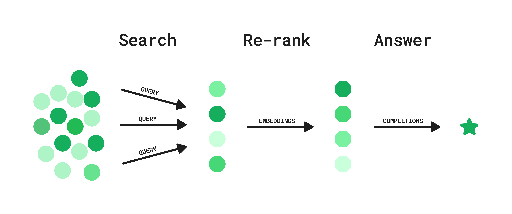
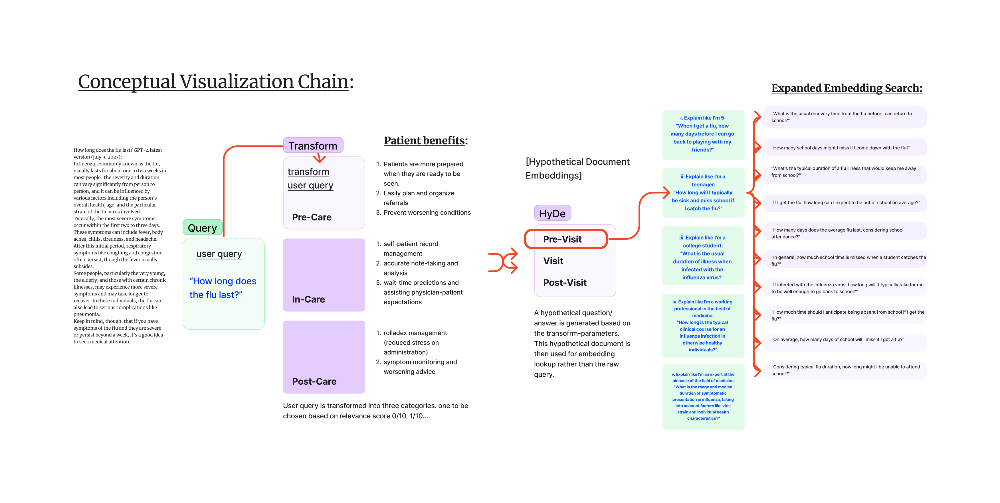

# MITP: Medical Information Training & Personalization
<h2>Welcome to Medex-Public-MITP: Transforming Healthcare with AI 🌍🚀</h2>

 

    

<h3>Quick-note: The below was generated by GPT-4 after review of the repo URL. While it looks nice, it does not capture the essence of the project, and misses the mark on what's important and why. If this is still up, I'm working on my human version to be implemented as soon as possible.</h3>

<h4>Daily updates have moved to our Wiki, which otherwise is being used as a conceptual journal of types: https://github.com/acdc-digital/Medex-Public-MITP/wiki/Daily%E2%80%90Updates</h4>

<h2>What is Medex-Public-MITP?</h2><h3>🧐</h3>
  
Medex-Public-MITP is an open-source project that leverages the power of artificial intelligence to transform the way we access and understand medical information. It's a platform where technology meets healthcare, creating a bridge between complex medical literature and the people who need this information the most.

<h2>How Does It Work?</h2><h3>🤔</h3>

At the heart of Medex is a sophisticated AI model that takes your medical queries, delves into the vast world of PubMed articles, and provides clear, insightful responses. It's like having a personal medical researcher at your fingertips, ready to dive into the depths of medical literature and bring you the answers you need.

But that's not all. Medex goes a step further by generating hypothetical answers based on your query, searching PubMed for relevant findings, and combining all this information into a simple output for contextual understanding. It's a hybrid approach that offers relatively low latency and can be integrated into any existing search endpoint, without requiring the upkeep of a vector database.

<h2>Why Medex?</h2><h3>🎯</h3>

Medex is more than just a tool; it's a mission. A mission to make healthcare information more accessible, more understandable, and more user-friendly. It's about breaking down the barriers between people and the medical information they need. It's about empowering individuals to take charge of their health by providing them with the information they need to make informed decisions.

<h2>Join the Mission</h2><h3>🤝</h3>

But Medex isn't just about technology. It's about people like you. Whether you're a coder, a scientist, or someone who believes in making healthcare information more accessible, you're welcome here. We believe in the power of community and collaboration, and we know that the best ideas come from diverse perspectives coming together to solve a common problem.

So, roll up your sleeves and dive into this project. Contribute your code, share your ideas, and help us make Medex even better. Together, we can make a difference in the world of healthcare.

<h2>Some cool info in our latest daily-updates wiki:</h2>
<h4>The OpenAI Cookbook</h4>
The OpenAI-Cookbook [https://github.com/openai/openai-cookbook] has been an incredible resource. Recently, I've discovered, "Question/ answering using an API and HyDe." Which I believe will be a sucessful priliminary implementation  of how we're going to transform our User query's. 




The concept is simple enough: Step 1: Search; User asks a question and GPT generates a list of potential queries. Search queries are executed in parallel. Step 2: Re-rank; Embeddings for each result are used to calculate semantic similarity to a generated hypothetical ideal answer to the user question. Results are ranked and filtered based on this similarity metric.
Step 3: Answer; Given the top search results, the model generates an answer to the user’s question, including references and links.
This hybrid approach offers relatively low latency and can be integrated into any existing search endpoint, without requiring the upkeep of a vector database.
<h6>End Article.</h6>

<h4>Visualizing Medex in Figjam</h4>
The below is a placeholder for now until the finished diagram is done. We're slowly working through the visualization of the program in order to understand its User-Centric attributes. We want to esnure that Medex is not only the engine, but the whole vehicle that helps our Users get the information they need, when they need it. 


<h6>End of Article.</h6>

<h2>Getting Started w/ Medex 🚀🚀🚀</h2> 

To get started with Medex, simply clone this repository and follow the instructions provided in the repository's README. The project is in active development, so don't hesitate to ask questions, report issues, or suggest improvements. We're all here to learn and grow together.

```
git clone https://github.com/acdc-digital/Medex-Public-MITP  
```
```cd /Users/filepath/Medex-Public-MITP/Medex```  and simply copy and paste into your notebook as needed. The Jupyter Playground will eventually become a Colab notebook, but for now, set up a new environment and follow along with the code-blocks. We'll keep the blocks in the playground as the latest stable version, as other documents may continue to get tinkered with throughout development and may or may-not be runnable at certain times. 

<h1>Final Words 🎉</h1>

Welcome to the Medex community! We're thrilled to have you here and we can't wait to see how you contribute to this project. Remember, change doesn't happen from the top down, but from the bottom up. So let's make a difference, together.
